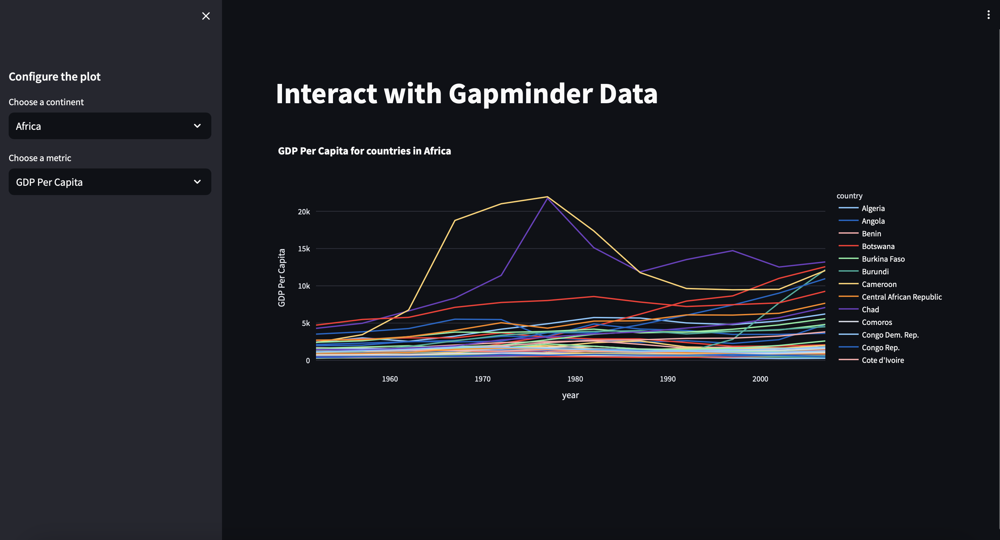

# Streamlit Tester

This is a quick test replicating code found at https://carpentries-incubator.github.io/python-interactive-data-visualizations/index.html

## Directions for use:

1. Clone the repository within the directory of your choice
2. Open a terminal or CLI and navigate to the streamlit_tester/src directory
3. Run the following command: streamlit run newapp.py

### notes:

* You may need to run the following commands to download the proper modules for the code to work:

    * pip install streamlit
    * pip install pandas
    * pip install plotly

## Screenshot of the app:

## Link for cloud hosted version of the app:
https://apptester-2nyunvme9zvqpd3b5pxfz7.streamlit.app/
